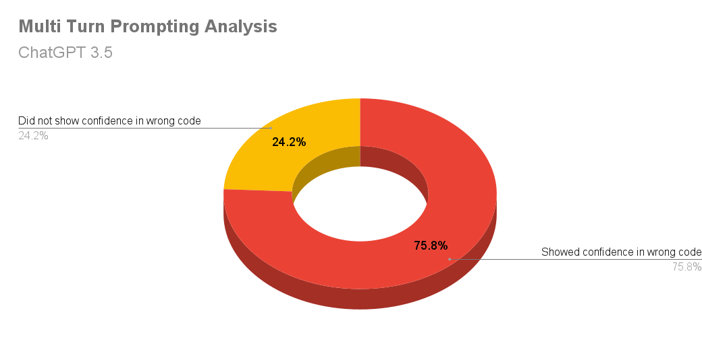
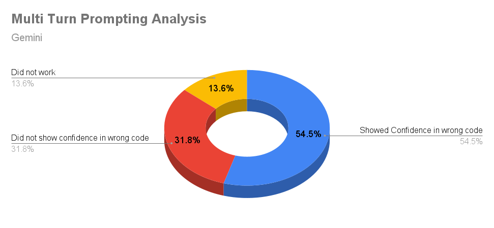

---

## Do Large Language Models Recognize Python Identifier Swaps in their Generated Code?

### Abstract

This repository contains the code and data related to our research paper, "Do Large Language Models Recognize Python Identifier Swaps in their Generated Code?" In this work, we evaluate the proficiency of Large Language Models (LLMs) such as ChatGPT-3.5, legacy Bard, and Gemini Pro in generating accurate and secure code, particularly focusing on the occurrence of identifier swaps. The repository includes scripts, datasets, and results based on our comprehensive analysis.

### Table of Contents

1. [Introduction](#introduction)
2. [Methodology](#methodology)
   1. [Dataset Generation](#dataset-generation)
   2. [Code Quality](#code-quality)
   3. [Manual Testing with Multi-turn Prompts](#manual-testing-with-multi-turn-prompts)
3. [Conclusion](#conclusion)
5. [References](#references)


### Introduction

In recent years, Large Language Models (LLMs) have shown remarkable advancements in natural language processing and code generation. However, their ability to write correct and secure code, particularly when it involves swapping identifiers, remains under scrutiny. This project aims to evaluate the code generation capabilities of LLMs using a diverse dataset and rigorous quality assessments.

### Methodology
The workflow we have proposed is:


#### Dataset Generation

The dataset used in this study includes a variety of coding tasks designed to challenge the code generation capabilities of LLMs. The data was collected from ChatGPT-3.5 (```text-davinci-002-render-sha```), Bard (legacy), and Gemini (```1.0-pro-001```). Each prompt was aimed at generating code snippets in Python, and our focus was on the ability of these models to recognize identifier swaps.

#### Code Quality

We used Pylint, a static code analysis tool, to evaluate the quality of the generated code. The code snippets were classified into three categories based on their Pylint scores:

1. **High Quality**: Pylint score greater than 7.
2. **Moderate Quality**: Pylint score between 3 and 7.
3. **Low Quality**: Pylint score less than 3.

            


#### Manual Testing with Multi-turn Prompts

To further assess the code snippets, we conducted manual multi-turn prompting (in a different session) to evaluate the models' ability to maintain context (provided in the first turn) and coherence. Note that this multi-turn conversation begins in a new session with the same LLM that generated the code. This session was conducted particularly for code snippets containing built-in functions, challenging the LLMs over sequential coding prompts.




**75.8\% of the tested prompts from ChatGPT 3.5 displayed confidence in wrong code (LLM response: ``output is same even with identifier swap''). A lesser percentage of 54.5\% was noted in Gemini’s outputs.** Our findings indicate that ChatGPT performes better on average in generating high-quality Python code compared to Bard and Gemini. However, Gemini showes relative robustness over ChatGPT in handling built-in identifier swaps. 

### Conclusion

LLMs have demonstrated impressive capabilities in generating code but also have vulnerabilities such as identifier swaps that pose challenges to software quality and security. The phenomenon of confidence in wrong code raises questions about the scalability of LLMs in code generation tasks and their reliability in professional programming environments.

### References

1. [LLMSecEval: A Dataset of Natural Language Prompts for Security Evaluations](https://github.com/tuhh-softsec/LLMSecEval.git).
2. [The Larger they are, the Harder they Fail: Language Models do not Recognize Identifier Swaps in Python](https://doi.org/10.18653/v1/2023.findings-acl.19).


---

